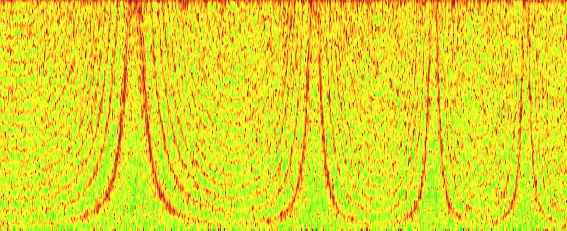
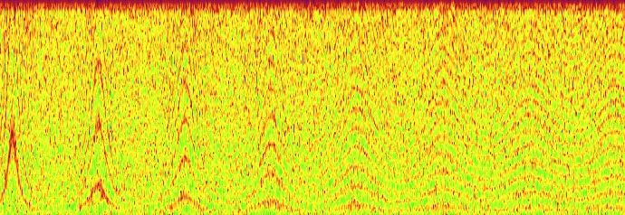
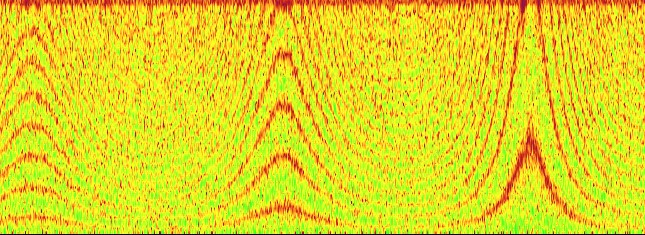
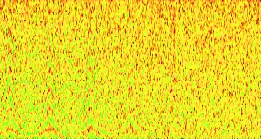
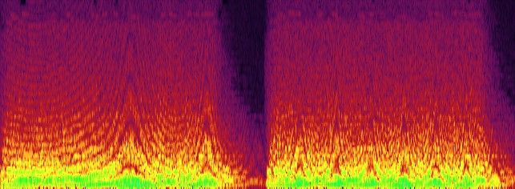

# UE4 Flanger Source Effect Plugin 

Based on this "Making a UE Plugin for Audio From Scratch" [UE4 Forum Thread](https://forums.unrealengine.com/development-discussion/audio/1825473-making-a-ue-plugin-for-audio-from-scratch) by [@MinusKelvin](https://twitter.com/minuskelvin), I created a Source Effect plugin for Unreal Engine 4 that links to a static library. The "Hello World" tutorial goes through the creation of a simple sinusoidal oscillator with a Volume control source effect. I expanded upon this and created a flanger effect plugin. 

In UE4, Source Effect Preset assets can be chained in a Source Effect Preset chain, which can be applied to a Sound Wave (audio file asset). Changing effect parameters can be auditioned in real time as the sound file plays in the editor! 

**Videos of the UE4 side here:**
[Effects of flanger on white noise, which contains a wide range of frequency content](https://twitter.com/thorontaur/status/1328438732840599552?s=20)
[Synth with effect, which makes cool sounds :)](https://twitter.com/thorontaur/status/1328438758186708992?s=20) 

## Flanger Effect
A [flanger effect](https://en.wikipedia.org/wiki/Flanging) is a digital signal processing effect created by mixing a signal with a delayed version of itself. The amount of delay is varied over time by a low frequency oscillator (LFO), a periodic signal with low frequency. This creates a multi-notched comb filter effect visible on a spectrogram (a visual frequency representation of the signal) as the signal and its delayed version add together and cancel out (constructive and destructive interference) at different points in time. 

The parameters I exposed in this plugin were: wet/dry amount (amount of delay and original signal), center delay, LFO frequency, and LFO amplitude. The delay amount for a given sample is equal to the center delay plus the sample of the LFO at the specified frequency, multiplied by the specified amplitude.  

## Spectrograms
Some spectrograms:   
White noise, increasing LFO frequency  
  

White noise, decreasing LFO amplitude  
  

White noise, decreasing center delay  
  

White noise, wet versus dry  
  

Synth with more interesting frequency content  
  

Spectrograms created with REAPER DAW, audio files [from](https://upload.wikimedia.org/wikipedia/commons/9/98/White-noise-sound-20sec-mono-44100Hz.ogg) [Wikipedia](https://upload.wikimedia.org/wikipedia/commons/5/56/Flanging_effect.ogg). 

Main C++ code for the plugin is in this repository, but depends on modified code from the UE4 forum thread linked above which I wasn't sure if I should upload here. 